# Real-World Production CI/CD: What Actually Happens

## 🎯 **Your Current Setup vs Real Production**

### **What You Have (Demo/Learning)**
```
┌─────────────────────────────────────────────────┐
│            Single Subscription                   │
├─────────────────────────────────────────────────┤
│ Dev Cluster    → Staging Cluster → Prod Cluster│
│ (East US)        (East US)         (East US)   │
│                                                 │
│ Manual approvals for production                │
│ Single region deployment                       │
│ Basic monitoring                               │
└─────────────────────────────────────────────────┘
```

### **Real Production Environment (Enterprise)**
```
┌──────────────────────────────────────────────────────────────────┐
│                    Multi-Subscription Architecture                │
├──────────────────────────────────────────────────────────────────┤
│                                                                   │
│  ┌────────────────┐  ┌────────────────┐  ┌────────────────┐    │
│  │ Non-Prod Sub   │  │ Prod Sub       │  │ Shared Services│    │
│  ├────────────────┤  ├────────────────┤  ├────────────────┤    │
│  │ • Dev (EUS)    │  │ • Prod (EUS)   │  │ • ACR          │    │
│  │ • QA (EUS)     │  │ • Prod (WUS)   │  │ • Key Vault    │    │
│  │ • Staging (WUS)│  │ • DR (CUS)     │  │ • Log Analytics│    │
│  │ • Perf (EUS)   │  │ • Canary (EUS) │  │ • Monitoring   │    │
│  └────────────────┘  └────────────────┘  └────────────────┘    │
│                                                                   │
│  + Multi-region load balancing (Azure Traffic Manager)          │
│  + Geo-distributed CDN (Azure Front Door)                       │
│  + Active-Active failover                                       │
│  + Regional data residency compliance                           │
└──────────────────────────────────────────────────────────────────┘
```

---

## 📊 **Real-World Environment Breakdown**

### **Typical Enterprise Setup (6-8 environments)**

| Environment | Purpose | Uptime | Deploy Frequency | Cost/Month |
|-------------|---------|--------|------------------|------------|
| **Dev** | Active development | Business hours | 50+ times/day | $129 |
| **QA** | Quality assurance testing | Business hours | 10 times/day | $200 |
| **UAT** | User acceptance testing | Business hours | 2-3 times/week | $200 |
| **Staging** | Pre-production validation | 24/7 | Daily | $500 |
| **Canary** | 5% production traffic | 24/7 | Every release | $300 |
| **Production (Primary)** | Main production (East US) | 24/7 | Weekly | $2,000 |
| **Production (Secondary)** | DR/Active (West US) | 24/7 | Sync with primary | $2,000 |
| **Performance** | Load testing | On-demand | Weekly | $150 (when running) |
| **TOTAL** | | | | **~$5,479/month** |

---

## 🔄 **Real Production CI/CD Pipeline Flow**

### **What Actually Happens in Production**

```mermaid
graph TD
    A[Developer Commits Code] --> B[Branch Protection Check]
    B --> C[PR Created]
    C --> D[Automated Tests]
    D --> E[Code Review Required]
    E --> F[Security Scan Required]
    F --> G[SonarQube Quality Gate]
    G --> H[PR Approved & Merged]
    
    H --> I[CI Pipeline Triggered]
    I --> J[Build All Services]
    J --> K[Unit Tests]
    K --> L[Integration Tests]
    L --> M[Security Scans]
    M --> N[SAST/DAST/SCA]
    N --> O[Push to ACR]
    
    O --> P[Deploy to Dev Auto]
    P --> Q[Smoke Tests]
    Q --> R[Deploy to QA Auto]
    R --> S[Regression Tests]
    S --> T[Deploy to UAT]
    T --> U[Manual UAT Approval]
    
    U --> V[Deploy to Staging]
    V --> W[Performance Tests]
    W --> X[Security Pen Tests]
    X --> Y[Business Sign-off]
    
    Y --> Z[Deploy to Canary 5%]
    Z --> AA[Monitor 2 hours]
    AA --> AB{Metrics OK?}
    AB -->|No| AC[Auto Rollback]
    AB -->|Yes| AD[Increase to 25%]
    AD --> AE[Monitor 4 hours]
    AE --> AF[Increase to 100%]
    
    AF --> AG[Deploy to Prod Primary]
    AG --> AH[Blue-Green Switch]
    AH --> AI[Monitor 24 hours]
    AI --> AJ[Deploy to Prod Secondary]
    AJ --> AK[Verify DR Sync]
```



---

## 🏭 **Real-World Deployment Timeline**

### **Small Change (Bug Fix)**
```
Day 1:
09:00 - Developer commits fix
09:15 - PR created, CI runs (15 min)
10:00 - Code review completed
11:00 - PR merged to main
11:05 - Deploy to Dev (auto)
11:30 - Deploy to QA (auto)
14:00 - Deploy to Staging (scheduled window)
16:00 - Business approval

Day 2:
10:00 - Deploy to Canary (5% traffic)
12:00 - Increase to 25%
16:00 - Increase to 100%
18:00 - Deploy to Production primary
20:00 - Monitor 2 hours, all clear

Day 3:
02:00 - Deploy to Production DR (off-peak)
06:00 - Verify geo-replication

Total time: 45 hours from commit to full production
```

### **Major Release (New Feature)**
```
Week 1:
- Development and testing in Dev environment
- Daily deploys to Dev (50+ times)
- Feature flags enabled

Week 2:
- Deploy to QA on Monday
- QA team testing all week
- Bug fixes deployed to QA daily
- Friday: Deploy to UAT

Week 3:
- UAT testing Monday-Wednesday
- Business stakeholder demos Thursday
- Deploy to Staging Friday
- Performance testing over weekend

Week 4:
- Monday: Security pen testing
- Tuesday: Business sign-off
- Wednesday: Deploy to Canary (5%)
- Thursday: Monitor, increase to 25%
- Friday: Increase to 100%

Week 5:
- Monday: Deploy to Production primary (scheduled maintenance window 2 AM)
- Tuesday: Monitor 24 hours
- Wednesday: Deploy to Production DR
- Thursday: Final verification
- Friday: Feature flag fully enabled

Total time: 5 weeks from feature complete to full production
```

---

## 💼 **Real Production Team Structure**

### **Who's Involved**

| Role | Responsibilities | When Involved |
|------|------------------|---------------|
| **Developers** | Write code, fix bugs | Dev, QA |
| **QA Engineers** | Automated + manual testing | QA, UAT |
| **DevOps Engineers** | Pipeline management, infrastructure | All environments |
| **SREs** | Monitoring, incident response | Staging, Production |
| **Security Team** | Security scans, pen testing | Staging, Production |
| **Product Owners** | Business approval | UAT, Production |
| **Release Managers** | Coordinate releases | Staging, Production |
| **Database Admins** | Schema changes | Staging, Production |
| **Network Engineers** | Traffic management | Production |

### **Approval Gates (Real Production)**

```yaml
# Dev → Auto deploy (no approval)
# QA → Auto deploy (no approval)
# UAT → QA Lead approval required
# Staging → Product Owner approval required
# Canary → Release Manager + SRE approval required
# Production → CTO/VP approval required (change control board)
```

---

## 🔒 **Real Production Security & Compliance**

### **What You're Missing (Added in Real Production)**

```yaml
Security Scanning (Extended):
  - ✅ Trivy (container scanning)
  - SAST: SonarQube, Checkmarx
  - DAST: OWASP ZAP, Burp Suite
  - SCA: Snyk, WhiteSource
  - Secrets scanning: GitGuardian, GitHub Advanced Security
  - Compliance: Azure Policy, OPA Gatekeeper
  - License scanning: FOSSA

Infrastructure Security:
  - Private AKS clusters (no public API)
  - Azure Firewall for egress
  - Azure Bastion for SSH access
  - Just-in-Time VM access
  - Managed Identity (no passwords)
  - Azure Key Vault with HSM
  - Network policies (Calico)
  - Pod Security Standards
  - Admission controllers

Compliance Requirements:
  - SOC 2 Type II
  - ISO 27001
  - HIPAA (if healthcare)
  - PCI DSS (if payments)
  - GDPR (if EU data)
  - Audit logs (immutable, 7 years)
  - Change approval records
  - Incident response plan
```

---

## 📊 **Real Production Monitoring**

### **Observability Stack (Enterprise)**

```yaml
Your Current Setup:
  - Azure Monitor
  - Application Insights
  - Log Analytics
  - Basic alerts

Real Production Adds:
  Metrics:
    - Prometheus (custom metrics)
    - Grafana (dashboards)
    - Thanos (long-term storage)
    - VictoriaMetrics (high cardinality)
  
  Logs:
    - Elasticsearch/OpenSearch
    - Logstash/Fluentd
    - Kibana
    - Splunk (enterprise)
  
  Tracing:
    - Jaeger
    - Zipkin
    - OpenTelemetry Collector
    - Tempo
  
  APM:
    - Dynatrace
    - New Relic
    - Datadog
    - AppDynamics
  
  Alerting:
    - PagerDuty (on-call rotation)
    - Opsgenie
    - VictorOps
    - Slack/Teams integration
  
  Dashboards:
    - Service health dashboard
    - Business KPI dashboard
    - Cost dashboard
    - Security dashboard
    - Executive dashboard
```

---

## 🚨 **Real Production Incident Response**

### **What Happens When Things Break**

```
03:42 AM - Alert fired: High error rate in checkout service

03:42 AM - PagerDuty pages on-call SRE (smartphone vibrates)

03:45 AM - SRE acknowledges alert, checks dashboard
         - Error rate: 15% (threshold: 5%)
         - Last deploy: 2 hours ago
         - Affected: US-East region only

03:47 AM - SRE creates incident ticket
         - Severity: P1 (customer-facing)
         - Opens war room in Slack/Teams

03:50 AM - SRE triggers rollback
         - Command: helm rollback checkout -n production
         - Takes 2 minutes to complete

03:52 AM - Error rate drops to 0.5%
         - Customers can checkout again

03:55 AM - SRE pages lead developer
         - Root cause investigation begins

04:30 AM - Root cause identified: Database query timeout
         - Recent code change increased query complexity

06:00 AM - Fix developed and tested in dev
08:00 AM - Fix deployed to staging
14:00 AM - Fix deployed to production
15:00 PM - Post-mortem scheduled

Next Day:
10:00 AM - Post-mortem meeting
         - Timeline review
         - Root cause analysis
         - Action items identified
         - Monitoring improvements
         - Documentation updated

Cost of 2-hour outage:
  - Lost revenue: $50,000
  - Engineering time: $5,000
  - Customer goodwill: Priceless
  
Prevention cost (better monitoring): $500/month
ROI: 10,000%
```

---

## 💰 **Real Production Costs**

### **Medium-Sized Company (100-500 employees)**

```
Infrastructure (Azure):
  - AKS clusters (8 environments)         $5,500/month
  - Databases (PostgreSQL HA)             $2,000/month
  - Redis (Premium multi-zone)            $1,500/month
  - Event Hubs (Standard)                 $500/month
  - Storage (backups, logs)               $1,000/month
  - Networking (egress, load balancers)   $2,000/month
  - Monitoring (Log Analytics)            $1,500/month
  - Security tools                        $1,000/month

Third-Party Tools:
  - APM (Datadog/New Relic)              $3,000/month
  - Security scanning (Snyk)              $1,000/month
  - PagerDuty                             $1,000/month
  - GitHub Enterprise                     $500/month
  - Terraform Cloud                       $200/month
  - Slack                                 $300/month

Personnel (Cloud costs only, not salaries):
  - Training & certifications             $2,000/month
  - Consulting                            $5,000/month

TOTAL: ~$27,000/month (~$324,000/year)

Per developer cost: ~$1,080/month (25 developers)
```

### **Enterprise (500+ employees)**

```
Infrastructure costs: $50,000 - $150,000/month

Typical breakdown:
  - 15-20 AKS clusters across regions
  - Multi-region active-active
  - Premium everything (HA, backups, security)
  - Extensive monitoring and logging
  - Dedicated security infrastructure
  - Compliance tooling

Plus enterprise tools and support contracts
```

---

## 🎯 **Key Differences: Your Project vs Real Production**

| Aspect | Your Project | Real Production |
|--------|--------------|-----------------|
| **Environments** | 3 (Dev, Staging, Prod) | 6-8 (Dev, QA, UAT, Staging, Canary, Prod, DR, Perf) |
| **Regions** | 1 (East US) | 3+ (Multi-region for HA) |
| **Approvals** | Manual (Azure DevOps) | Multi-stage (CAB, business, security) |
| **Testing** | Smoke tests | Unit, integration, E2E, performance, security, chaos |
| **Monitoring** | Azure Monitor | Multi-tool stack (Prometheus, Grafana, Datadog, etc.) |
| **Security** | Trivy scanning | 10+ security tools, compliance frameworks |
| **Team Size** | 1-2 people | 15-50 people (dev, ops, security, QA) |
| **Deploy Time** | Minutes | Hours to weeks (depending on change) |
| **Cost** | $1,085/month | $5,000 - $150,000/month |
| **Uptime SLA** | Best effort | 99.95% - 99.99% ($$$$ penalties) |
| **On-call** | None | 24/7 rotation with PagerDuty |
| **Rollback** | Manual | Automated with observability |

---

## 📝 **What Makes Your Project "Real Enough"**

### ✅ **You Have (Production-Ready)**
- Multi-environment setup
- Automated CI/CD pipelines
- Security scanning
- Infrastructure as Code
- Monitoring and alerting
- Rollback capability
- Azure-native services

### ⚠️ **What's Simplified (vs Real Prod)**
- Single region (real: multi-region)
- Basic testing (real: extensive test suites)
- Simple approval (real: change control board)
- Limited environments (real: 6-8 environments)
- Manual rollback (real: automated with SLOs)

### 🎓 **Your Project is Perfect For:**
- ✅ Learning modern DevOps practices
- ✅ Interview demonstrations
- ✅ Portfolio projects
- ✅ Small team deployments
- ✅ MVP/startup products
- ✅ Understanding cloud architecture

### 🏢 **Ready for Small-Medium Production**
Your setup could support:
- 1-25 developers
- 10,000-100,000 users
- $100K-$1M annual revenue
- Single region deployment
- Standard compliance requirements

---

## 🚀 **How to Make It More "Real"**

### **Phase 1: Add Missing Environments (2 days)**
```bash
# Add QA environment
cp -r terraform/environments/dev terraform/environments/qa

# Add UAT environment
cp -r terraform/environments/dev terraform/environments/uat

# Cost increase: +$400/month
```

### **Phase 2: Multi-Region (1 week)**
```bash
# Add West US production cluster
# Configure Azure Traffic Manager
# Set up geo-replication

# Cost increase: +$2,500/month
```

### **Phase 3: Advanced Monitoring (3 days)**
```bash
# Add Prometheus + Grafana
# Set up PagerDuty
# Create runbooks

# Cost increase: +$1,000/month
```

### **Phase 4: Security Hardening (1 week)**
```bash
# Add SonarQube
# Configure private AKS clusters
# Implement network policies
# Add Azure Firewall

# Cost increase: +$1,500/month
```

---

**Bottom line**: Your project has **80% of what real production needs**, but at **20% of the cost**. Perfect for learning, demos, and small-scale production use. The remaining 20% (multi-region, advanced security, extensive testing) is where enterprise costs explode.
